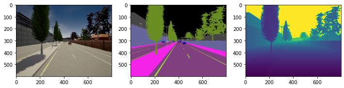
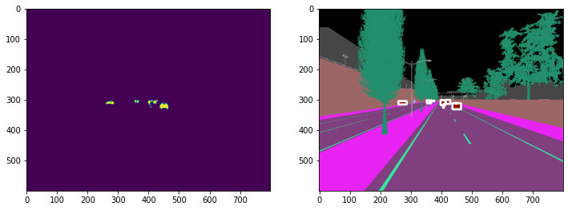
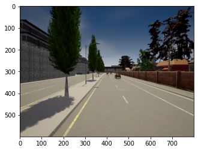

(updated July 2021)
This is a simple tutorial of how to run CARLA headless on a remote Ubuntu GPU server. We will autopilot drive a car around for getting image frames and sensor data. 

Webpage: <https://arijitray1993.github.io/CARLA_tutorial/> 

Code Repo to follow along: <https://github.com/arijitray1993/CARLA_tutorial> 


# Installation on Ubuntu

There are various ways to install CARLA:

## Easiest: Extract pre-computed binary file from their Github repo: 

Extract the appropriate tar.gz file from https://github.com/carla-simulator/carla/blob/master/Docs/download.md. 

Personally, on Ubuntu 16.04, 18.04 and 20.04, I have found version 9.10 and above to be unstable. Version 0.9.9 works perfectly for me without any compromise for features. 

If you use the stable version - 0.8.2, you lose out on a lot of cool customization features. 
- Extract the package. 
- If you are on a Ubuntu machine with a display and just want to play around: run 
```
 ./CarlaUE4.sh
```
- If you do not have a display (remote server), and want to use the CARLA with a PythonAPI: run 
```
 DISPLAY= ./CarlaUE4.sh -opengl -carla-server -benchmark -fps=10
```

This will always run on GPU 0. If you need to run on another GPU, see below. 

## Second Easiest, but Recommended: Use Docker + NVIDIA-Docker**:

First, install Docker CE 20.10.5 (do not install 20.10.6, it will require IPv6 to be enabled, or will throw an error) and NVIDIA-Docker2. This needs CUDA>10. Follow instructions in `install_docker.sh` and `install_nvidia_docker.sh` in this repo. 

After instaling, pull the carla image from dockerhub:

```
docker pull carlasim/carla:0.9.9
docker run -p 2000-2002:2000-2002 --runtime=nvidia -e NVIDIA_VISIBLE_DEVICES=0 carlasim/carla:0.9.9 /bin/bash CarlaUE4.sh -opengl –carla-server -benchmark -fps=10
```

Use the `NVIDIA_VISIBLE_DEVICES=0` flag to choose your GPU number. 
This should print stuff like:
```
4.24.3-0+++UE4+Release-4.24 518 0
Disabling core dumps.
sh: 1: xdg-user-dir: not found
```

This is fine, it means carla is running. To verify, run `docker container ls` and it should show a carla container running. If you don't see anything, then it must have failed silently. Look at steps below. 

## Some common errors

Sometimes, the above command can give a segmentation fault with signal 11 and memory overflow (**sometimes it fails silently**).

Run the CARLA container in interactve mode and check the GPU:

```
docker run -p 2000-2002:2000-2002 --runtime=nvidia -e NVIDIA_VISIBLE_DEVICES=0 --name carla_container -it carlasim/carla:0.9.9 /bin/bash
nvidia-smi
```

Make sure there is only 1 GPU shown and it's empty. 

Inside the container, run 

```
./CarlaUE4.sh -opengl -carla-server -benchmark -fps=10
```

If it still doesn't work, you will probably need to try another version of CARLA - most likely a lower version. 

Another option is to try the stable 0.8.2 version. It lacks functionality, but it has a verbose output when running the `./CarlaUE4.sh` file. This can give you an idea of what might be going wrong. 
    

If it seems to be working, proceed to the Python API tutorial section below.


# Python API Tutorial

If you want, you can clone this repository: `git clone https://github.com/arijitray1993/CARLA_tutorial.git` and follow along in `playground.ipynb`. 

## Copy PythonAPI folder from the docker container

We need to copy the PythonAPI/ folder from inside the docker container in order to use it with Python. Python will communicate with the CARLA simulation running inside the docker container using the TCP ports 2000-2002. 

`docker cp carla_container:/home/carla/PythonAPI ./`

This should replace the `PythonAPI` folder that you cloned from this repository. This is very important - make sure to copy the Python API from the container you are running and not from any other version. 

## Importing CARLA and miscellaneous packages

```python
import glob
import os
import sys

try:
    sys.path.append(glob.glob('PythonAPI/carla/dist/carla-*%d.%d-%s.egg' % (
        sys.version_info.major,
        sys.version_info.minor,
        'win-amd64' if os.name == 'nt' else 'linux-x86_64'))[0])
except IndexError:
    pass

import carla
import random
import cv2
import skimage.measure as measure

#in synchronous mode, sensor data must be added to a queue
import queue

```

## Loading the CARLA World using the Python API

### Connecting the Python Client on the `2000 PORT`


```python
client = carla.Client('localhost', 2000)
client.set_timeout(11.0)
```

CARLA is initiated using some pre-loaded maps that CARLA offers. To see all maps avaliable, do:


```python
print(client.get_available_maps())
```

    ['/Game/Carla/Maps/Town02', '/Game/Carla/Maps/Town01', '/Game/Carla/Maps/Town03', '/Game/Carla/Maps/Town04', '/Game/Carla/Maps/Town05']


### Loading Settings into CARLA world instance

Details for the maps can be found at https://carla.readthedocs.io/en/0.9.9/core_map/  

Let's first load a map and load into the CARLA world. 

We need to run CARLA in synchronous mode to allow Python to keep up with the simulations. This is very important. 


```python
world = client.load_world('Town03')
settings = world.get_settings()
settings.fixed_delta_seconds = 0.05 #must be less than 0.1, or else physics will be noisy
#must use fixed delta seconds and synchronous mode for python api controlled sim, or else 
#camera and sensor data may not match simulation properly and will be noisy 
settings.synchronous_mode = True 
world.apply_settings(settings)
```


    928


### Changing the weather


```python
weather = carla.WeatherParameters(
    cloudiness=20.0,
    precipitation=20.0,
    sun_altitude_angle=110.0)

#or use precomputed weathers
#weather = carla.WeatherParameters.WetCloudySunset

world.set_weather(weather)

```

### Managing Objects in the world

Objects in the simulation are managed using blueprints. Blueprint is a template for an object and we can deploy an intantiation of any object we desire in the world. Let's see some examples of blueprints available.


```python
blueprints = world.get_blueprint_library().filter('*')
for blueprint in random.sample(list(blueprints), 5):
    print(blueprint.id)
    for attr in blueprint:
       print('  - {}'.format(attr))

```

    vehicle.lincoln.mkz2017
      - ActorAttribute(id=number_of_wheels,type=int,value=4(const))
      - ActorAttribute(id=sticky_control,type=bool,value=True)
      - ActorAttribute(id=object_type,type=str,value=(const))
      - ActorAttribute(id=color,type=Color,value=Color(15,11,44,255))
      - ActorAttribute(id=role_name,type=str,value=autopilot)
    static.prop.plastictable
      - ActorAttribute(id=size,type=str,value=medium(const))
      - ActorAttribute(id=role_name,type=str,value=prop)
    static.prop.bench02
      - ActorAttribute(id=size,type=str,value=medium(const))
      - ActorAttribute(id=role_name,type=str,value=prop)
    sensor.camera.rgb
      - ActorAttribute(id=chromatic_aberration_intensity,type=float,value=0)
      - ActorAttribute(id=white_clip,type=float,value=0.04)
      - ActorAttribute(id=toe,type=float,value=0.55)
      - ActorAttribute(id=shoulder,type=float,value=0.26)
      - ActorAttribute(id=blur_radius,type=float,value=0)
      - ActorAttribute(id=blur_amount,type=float,value=1)
      - ActorAttribute(id=blade_count,type=int,value=5)
      - ActorAttribute(id=min_fstop,type=float,value=1.2)
      - ActorAttribute(id=exposure_speed_up,type=float,value=3)
      - ActorAttribute(id=exposure_min_bright,type=float,value=0.1)
      - ActorAttribute(id=motion_blur_min_object_screen_size,type=float,value=0.1)
      - ActorAttribute(id=slope,type=float,value=0.88)
      - ActorAttribute(id=motion_blur_max_distortion,type=float,value=0.35)
      - ActorAttribute(id=motion_blur_intensity,type=float,value=0.45)
      - ActorAttribute(id=enable_postprocess_effects,type=bool,value=True)
      - ActorAttribute(id=temp,type=float,value=6500)
      - ActorAttribute(id=iso,type=float,value=1200)
      - ActorAttribute(id=tint,type=float,value=0)
      - ActorAttribute(id=calibration_constant,type=float,value=16)
      - ActorAttribute(id=shutter_speed,type=float,value=60)
      - ActorAttribute(id=focal_distance,type=float,value=1000)
      - ActorAttribute(id=exposure_compensation,type=float,value=3)
      - ActorAttribute(id=exposure_mode,type=str,value=manual)
      - ActorAttribute(id=lens_y_size,type=float,value=0.08)
      - ActorAttribute(id=lens_x_size,type=float,value=0.08)
      - ActorAttribute(id=lens_kcube,type=float,value=0)
      - ActorAttribute(id=gamma,type=float,value=2.2)
      - ActorAttribute(id=lens_k,type=float,value=-1)
      - ActorAttribute(id=exposure_max_bright,type=float,value=2)
      - ActorAttribute(id=fstop,type=float,value=1.4)
      - ActorAttribute(id=lens_circle_multiplier,type=float,value=0)
      - ActorAttribute(id=lens_circle_falloff,type=float,value=5)
      - ActorAttribute(id=black_clip,type=float,value=0)
      - ActorAttribute(id=fov,type=float,value=90)
      - ActorAttribute(id=exposure_speed_down,type=float,value=1)
      - ActorAttribute(id=image_size_y,type=int,value=600)
      - ActorAttribute(id=image_size_x,type=int,value=800)
      - ActorAttribute(id=sensor_tick,type=float,value=0)
      - ActorAttribute(id=chromatic_aberration_offset,type=float,value=0)
      - ActorAttribute(id=role_name,type=str,value=front)
    static.prop.streetsign04
      - ActorAttribute(id=size,type=str,value=small(const))
      - ActorAttribute(id=role_name,type=str,value=prop)


### Instantiating the Objects

First, it is a good practice to keep track of all objects being instantiated in a list. This is because objects dont die when the simulation ends, and we will need to destroy each of them if we desire to load a new world map. 


```python
actor_list = []
```

Next, we can instantiate objects as shown below and add them to the actor list. 

### Let's first add our main vehicle 


```python
blueprint_library = world.get_blueprint_library()
bp = random.choice(blueprint_library.filter('vehicle')) # lets choose a vehicle at random

# lets choose a random spawn point
transform = random.choice(world.get_map().get_spawn_points()) 

#spawn a vehicle
vehicle = world.spawn_actor(bp, transform) 
actor_list.append(vehicle)

vehicle.set_autopilot(True)
```

### Now let's add more vehicles


```python
#lets create waypoints for driving the vehicle around automatically
m= world.get_map()
waypoint = m.get_waypoint(transform.location)

#lets add more vehicles
for _ in range(0, 200):
    transform = random.choice(m.get_spawn_points())

    bp_vehicle = random.choice(blueprint_library.filter('vehicle'))

    # This time we are using try_spawn_actor. If the spot is already
    # occupied by another object, the function will return None.
    other_vehicle = world.try_spawn_actor(bp_vehicle, transform)
    if other_vehicle is not None:
        #print(npc)
        other_vehicle.set_autopilot(True)
        actor_list.append(other_vehicle)
```

### Let's also add some weird objects. 


```python
# Adding random objects
blueprint_library = world.get_blueprint_library()
weirdobj_bp = blueprint_library.find('static.prop.fountain')
weirdobj_transform = random.choice(world.get_map().get_spawn_points())
weirdobj_transform = carla.Transform(carla.Location(x=230, y=195, z=40), carla.Rotation(yaw=180))
weird_obj = world.try_spawn_actor(weirdobj_bp, weirdobj_transform)
actor_list.append(weird_obj)
```

## Adding Sensors to Vehicles

Let's add a camera, depth camera and a semantic segmentation camera to the main vehicle we defined above in the variable `vehicle`.

### Attaching camera and depth camera for semantic segmentation to a vehicle 


```python
#example for getting camera image
camera_bp = blueprint_library.find('sensor.camera.rgb')
camera_transform = carla.Transform(carla.Location(x=1.5, z=2.4))
camera = world.spawn_actor(camera_bp, camera_transform, attach_to=vehicle)
image_queue = queue.Queue()
camera.listen(image_queue.put)
actor_list.append(camera)

#example for getting depth camera image
camera_depth = blueprint_library.find('sensor.camera.depth')
camera_transform = carla.Transform(carla.Location(x=1.5, z=2.4))
camera_d = world.spawn_actor(camera_depth, camera_transform, attach_to=vehicle)
image_queue_depth = queue.Queue()
camera_d.listen(image_queue_depth.put)
actor_list.append(camera_d)

#example for getting semantic segmentation camera image
camera_semseg = blueprint_library.find('sensor.camera.semantic_segmentation')
camera_transform = carla.Transform(carla.Location(x=1.5, z=2.4))
camera_seg = world.spawn_actor(camera_semseg, camera_transform, attach_to=vehicle)
image_queue_seg = queue.Queue()
camera_seg.listen(image_queue_seg.put)
actor_list.append(camera_seg)
```

## Some helper functions we will need later. Feel free to skip this for now to the next section. 


```python
import matplotlib.pyplot as plt
import matplotlib.image as mpimg
import numpy as np
import pycocotools
import math
from scipy.spatial import distance

def get_mask(seg_im, rgb_value):
    # rgb_value should be somethiing like np.uint8([[[70, 70, 70]]])
    # seg_im should be in HSV
    
    hsv_value = cv2.cvtColor(rgb_value, cv2.COLOR_RGB2HSV)
    
    hsv_low = np.array([[[hsv_value[0][0][0]-5, hsv_value[0][0][1], hsv_value[0][0][2]-5]]])
    hsv_high = np.array([[[hsv_value[0][0][0]+5, hsv_value[0][0][1], hsv_value[0][0][2]+5]]])
    
    mask = cv2.inRange(seg_im, hsv_low, hsv_high)
    return mask

def get_bbox_from_mask(mask):
    label_mask = measure.label(mask)
    props = measure.regionprops(label_mask)
    
    return [prop.bbox for prop in props]
   
```

## Running the simulation to get data

`world.tick()` runs one step of the simulation. 


```python
## get location of weird obj
world.tick()
```


### Getting camera data 

Let's get the data from the queues we defined to push data into while setting up the cameras.


```python
#rgb camera
image = image_queue.get()

#semantic segmentation camera
image_seg  = image_queue_seg.get()

#depth camera
image_depth = image_queue_depth.get()
```

### We can now save the camera images to file. 


```python
image.save_to_disk("test_images/%06d.png" %(image.frame))
image_seg.save_to_disk("test_images/%06d_semseg.png" %(image.frame), carla.ColorConverter.CityScapesPalette)
image_depth.save_to_disk("test_images/%06d_depth.png" %(image.frame), carla.ColorConverter.LogarithmicDepth)
```


### Let's visualize these images


```python
img = mpimg.imread("test_images/%06d.png" % image.frame)
img_semseg = mpimg.imread("test_images/%06d_semseg.png" % image.frame)
img_depth = mpimg.imread("test_images/%06d_depth.png" % image.frame)

fig, (ax1, ax2, ax3) = plt.subplots(1, 3, figsize = (12,18))
ax1.imshow(img)
ax2.imshow(img_semseg)
ax3.imshow(img_depth) 
plt.show()
```


    

    


### Interpreting the Segmentation Maps
Let's first read the segmentation maps in HSV color space since it is easier to process color-based segmentation in that format.


```python
img_semseg_bgr = cv2.imread("test_images/%06d_semseg.png" % image.frame)
img_semseg_bgr = cv2.cvtColor(img_semseg_bgr, cv2.COLOR_BGRA2BGR)
img_semseg_hsv = cv2.cvtColor(img_semseg_bgr, cv2.COLOR_BGR2HSV) # color wise segmentation is better in hsv space
```

In the segmentation image, CARLA currently supports only certain objects and not all the objects we listed in the blueprint. The list of supported objects are at https://carla.readthedocs.io/en/0.9.9/ref_sensors/. Shown below are the BGR values for some of the common supported objects we could be interested in. 


```python
#bgr value exmaples of few objects: full list at https://carla.readthedocs.io/en/0.9.9/ref_sensors/ 
object_list = dict()
object_list['building'] = np.uint8([[[70, 70, 70]]])        
object_list['pedestrian'] = np.uint8([[[220, 20, 60]]])
object_list['vegetation'] = np.uint8([[[107, 142, 35]]])
object_list['car'] = np.uint8([[[ 0, 0, 142]]])
object_list['fence'] = np.uint8([[[ 190, 153, 153]]])
object_list['traffic_sign'] = np.uint8([[[220, 220, 0]]])
object_list['pole'] = np.uint8([[[153, 153, 153]]])
object_list['wall'] = np.uint8([[[102, 102, 156]]])
```

### As an example, let's get the bounding boxes of cars from the segmentation images

Refer to the helper functions `get_mask` and `get_bbox_from_mask` we defined above.

`get_mask()` isolates the object's mask from the segmentation image.

`get_bbox_from_mask()` computes the bounding boxes from the isolates object's mask. 


```python
mask = get_mask(img_semseg_hsv, object_list['car'])
bboxes = get_bbox_from_mask(mask)
```

### Let's visualize the car segmentation mask and the bboxes


```python
fig, (ax1, ax2) = plt.subplots(1, 2, figsize = (12,18))
ax1.imshow(mask)
for bbox in bboxes:
    minr, minc, maxr, maxc = bbox
    cv2.rectangle(img_semseg_bgr, (minc,minr), (maxc, maxr), (255,255,255), 6)

ax2.imshow(img_semseg_bgr)
plt.show()
```


    

    
## ToDo: Get Bounding boxes for unsupported objects (eg, fountains)

Currently, we can get the global coordinates of the object using `get_location()` or `get_transform()`. 

```python
weirdobj_loc = weird_obj.get_location()
# returns x, y, z as weirdobj_loc.x, weirdobj_loc.y, weirdobj_loc.z

weirdobj_transform = weird_obj.get_transform()
# returns x, y, z as weirdobj_transform.location.x, weirdobj_transform.location.y, weirdobj_transform.location.z
# also returns pitch, yaw, roll as weirdobj_transform.rotation.pitch, weirdobj_transform.rotation.yaw, weirdobj_transform.rotation.roll

#similarly we can get the camera transform
camera_transform = camera.get_transform()
```

From the CARLA documentation, we also know that the camera has a field of view angle of 90 degrees as default. 
We need to somehow map the global coordinates to camera field of view 2-D coordinates. I will update this soon, or if you do it sooner, feel free to fork it or submit a pull request.

<!-- ### Experimental: Getting Bounding Boxes for non-supported objects in CARLA 

This is an experimental function I wrote to get the location of a non-supported object in the segmentation image. 

We can get the global coordinate of the object and the camera, along with the rotation of the camera. We can compute the location of the object in the image using this information in the function we defined above called `get_camera_bbox_from_global()`  [here](https://arijitray1993.github.io/CARLA_tutorial/#some-helper-functions-we-will-need-later-feel-free-to-skip-this-for-now-to-the-next-section).

It is yet to be seen if this actually works, I will confirm and fix this soon. If coordinates returned are negative or greater than (600,800), it should mean the object is outside the camera's frame of view. 


```python
def get_camera_bbox_from_global(carlaLocObj, carlaTransformCamera):
    # takes in carla locations of object and camera and returns the bbox in camera frame. 
    # returns -1,-1,-1,-1 if outside box
    obj_x, obj_y, obj_z = carlaLocObj.x, carlaLocObj.y, carlaLocObj.z 
    
    cam_x, cam_y, cam_z = carlaTransformCamera.location.x, carlaTransformCamera.location.y, carlaTransformCamera.location.z
    
    pitch, yaw, roll = carlaTransformCamera.rotation.pitch, carlaTransformCamera.rotation.yaw, carlaTransformCamera.rotation.roll
    
    #adjust for pitch, yaw, roll. 
    y_corr = obj_y*math.cos(pitch)
    z_corr = obj_z*math.cos(yaw)
    x_corr = obj_z*math.cos(roll)
    
    
    #calculating the center y coord in image frame
    d_cm = distance.euclidean([cam_x, cam_y], [obj_x, obj_y])
    
    d_me = d_cm/math.tan(45)
    
    d_co = distance.euclidean([cam_x, cam_y, cam_z], [obj_x, obj_y, obj_z])
    
    d_om = np.sqrt(d_co**2 - d_cm**2)
    
    d_oe = d_me - d_om
    
    img_y = 800 - d_oe
    
    
    #calculating the center x coord in image frame
    d_cm = np.sqrt((obj_y - cam_y)**2)
    
    d_me = d_cm/(math.tan(45))
    
    d_om = np.sqrt(d_co**2 - d_om**2)
    
    img_x = d_me - d_om
    
    return img_x, img_y 

# getting weird object locations
weirdobj_loc = weird_obj.get_location()

# returns bbox in camera frame from global cordinates
x_c, y_c = get_camera_bbox_from_global(weirdobj_loc, camera.get_transform())

print(x_c, y_c)
```

    -120.1675936781445 690.4643695022289


The non-supported object we added was a fountain. The coordinates x coordinate is -ve and hence, we cannot see it in the frame.


```python
plt.imshow(img)
```


    <matplotlib.image.AxesImage at 0x7f4474499f50>


    

    
-->

## Driving the vehicle

In order to auto-pilot the vehicle to just drive around and get data, we can choose the next random waypoint on the map and set the vehicle location to that waypoint. 


```python
waypoint = random.choice(waypoint.next(1.5))
vehicle.set_transform(waypoint.transform)
```

Now, we can repeat the steps above to get the sensor data again. 

We can also control the vehicle's accelaration and steering using python. This is especially useful if you would like an AI agent to control the vehicle. I will update how to do so soon. 


## Optional: Now, let's put this in a `for` loop and collect some data in MS COCO format

`dataset_dicts` will contain the data in MS-COCO format. You can save that as a json file. However, the file can become very large. So, you can also save a separate file for each image. 


```python
from detectron2.structures import BoxMode
#in sychronous mode, client controls step of simulation and number of steps
dataset_dicts = []
global_count=0
for i in range(100):
    #step
    world.tick()

    #rgb camera
    image = image_queue.get()

    #semantic segmentation camera
    image_seg  = image_queue_seg.get()
    #image_seg.convert(carla.ColorConverter.CityScapesPalette)

    #depth camera
    image_depth = image_queue_depth.get()
    #image_depth.convert(carla.ColorConverter.LogarithmicDepth)
    
    
    if i%10==0:
        image.save_to_disk("test_images/%06d.png" %(image.frame))
        image_seg.save_to_disk("test_images/%06d_semseg.png" %(image.frame), carla.ColorConverter.CityScapesPalette)
        image_depth.save_to_disk("test_images/%06d_depth.png" %(image.frame), carla.ColorConverter.LogarithmicDepth)

        img = mpimg.imread("test_images/%06d.png" % image.frame)
        img_semseg = mpimg.imread("test_images/%06d_semseg.png" % image.frame)
        img_depth = mpimg.imread("test_images/%06d_depth.png" % image.frame)
        
        ## COCO format stuff, each image needs to have these keys
        height, width = cv2.imread("test_images/%06d.png" %(image.frame)).shape[:2]
        record = {}
        record['file_name'] = "test_images/%06d.png" %(image.frame)
        global_count+=1
        record['image_id'] = global_count
        record['height'] = height
        record['width'] = width
        
        
        fig, (ax1, ax2, ax3, ax4, ax5) = plt.subplots(1, 5, figsize = (12,18))
        ax1.imshow(img)
        ax2.imshow(img_semseg)
        ax3.imshow(img_depth) 
        
        
        
        ## compute bboxes from semseg
        img_semseg_bgr = cv2.imread("test_images/%06d_semseg.png" % image.frame)
        img_semseg_bgr = cv2.cvtColor(img_semseg_bgr, cv2.COLOR_BGRA2BGR)
        img_semseg_hsv = cv2.cvtColor(img_semseg_bgr, cv2.COLOR_BGR2HSV) # color wise segmentation is better in hsv space

        #bgr value exmaples of few objects: full list at https://carla.readthedocs.io/en/0.9.9/ref_sensors/ 
        object_list = dict()
        object_list['building'] = np.uint8([[[70, 70, 70]]])        
        object_list['pedestrian'] = np.uint8([[[220, 20, 60]]])
        object_list['vegetation'] = np.uint8([[[107, 142, 35]]])
        object_list['car'] = np.uint8([[[ 0, 0, 142]]])
        object_list['fence'] = np.uint8([[[ 190, 153, 153]]])
        object_list['traffic_sign'] = np.uint8([[[220, 220, 0]]])
        object_list['pole'] = np.uint8([[[153, 153, 153]]])
        object_list['wall'] = np.uint8([[[102, 102, 156]]])
        
        object_bboxes = dict()
        objects = []
        obj_id = 0
        obj2id = dict()
        for obj in object_list:
            mask = get_mask(img_semseg_hsv, object_list[obj])
            bboxes = get_bbox_from_mask(mask)
            object_bboxes[obj] = bboxes
            
            #let's visualize car bboxes
            if obj=='car':
                ax4.imshow(mask)
                for bbox in bboxes:
                    minr, minc, maxr, maxc = bbox
                    cv2.rectangle(img_semseg_bgr, (minc,minr), (maxc, maxr), (255,255,255), 6)
        
                ax5.imshow(img_semseg_bgr)
            
            #lets put things in coco format for finetuning mask rcnn
            for bbox in bboxes:
                minr, minc, maxr, maxc = bbox
                obj_mask = np.copy(mask)
                obj_mask[:minr] = 0
                obj_mask[:, :minc] = 0
                obj_mask[maxr+1:] = 0
                obj_mask[:, maxc+1:] = 0

                coco_rle_mask = pycocotools.mask.encode(np.array(obj_mask, order="F"))
                
                obj_ann = {
                        'bbox': [minc, minr, maxc, maxr],
                        'bbox_mode': BoxMode.XYXY_ABS,
                        'segmentation': coco_rle_mask,
                        'category_id': obj_id
                }
                objects.append(obj_ann)
                
                obj_id+=1
                obj2id[obj] = obj_id
        
        

        record['annotations'] = objects
        
        print(record)
        
        dataset_dicts.append(record)
                
            
        #plt.show()
    
    #drive vehicle to next waypoint on map
    waypoint = random.choice(waypoint.next(1.5))
    vehicle.set_transform(waypoint.transform)
        
```

## Finally, we need to destroy all the actors in the simulation 


```python
#make sure to destroy all cameras and actors since they remain in the simulator even if you respawn using python. 
#It gets destroyed only if you restart CARLA simulator
camera.destroy()
camera_d.destroy()
camera_seg.destroy()
client.apply_batch([carla.command.DestroyActor(x) for x in actor_list])
```

 

